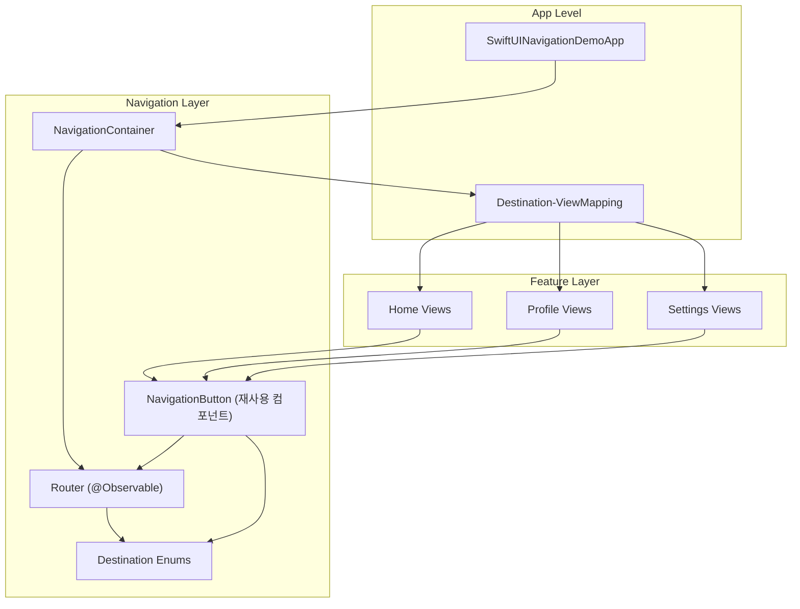
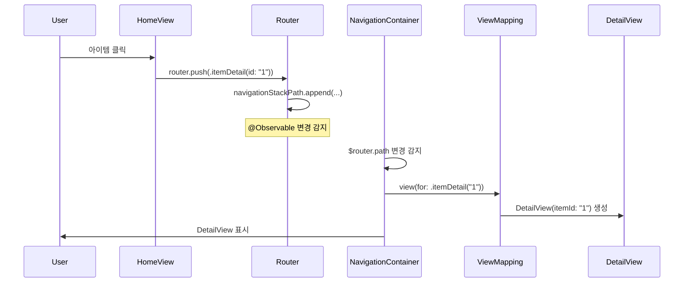
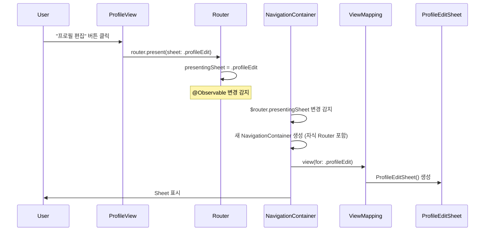
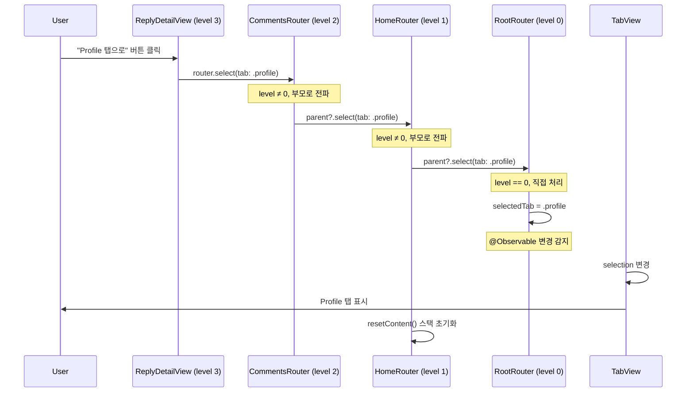
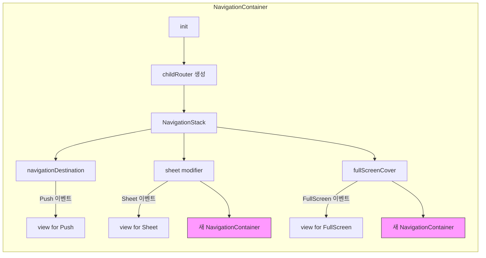
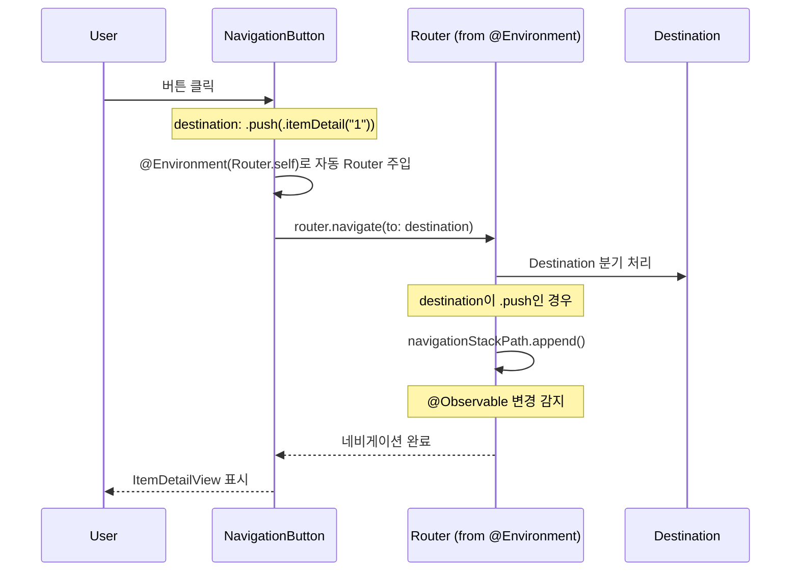

# SwiftUI Navigation Demo

> 확장 가능하고 테스트 가능한 SwiftUI 네비게이션 아키텍처 데모

## 주요 목표

1. **결합도 낮은 네비게이션**: 화면 간 직접 의존성 제거
2. **중앙 집중식 관리**: 모든 네비게이션 로직을 한 곳에서 제어
3. **테스트 가능성**: 네비게이션 로직을 독립적으로 테스트 가능
4. **딥링크 지원**: URL 기반 네비게이션을 쉽게 구현
5. **iOS 17+ 현대화**: @Observable 매크로 활용

## ⚠️ 기존 SwiftUI Navigation API의 한계

### 1. NavigationLink의 강한 결합

```swift
// ❌ 문제: HomeView가 DetailView를 직접 알아야 함
NavigationLink(destination: DetailView(item: item)) {
    Text(item.title)
}
```

- 화면 A가 화면 B의 존재를 알아야 함
- 뷰 간 의존성이 증가하여 모듈화 어려움
- 테스트 시 모든 화면을 함께 빌드해야 함

### 2. 복잡한 상태 관리

```swift
// ❌ 문제: 여러 @State로 네비게이션 상태 분산
@State private var showSheet = false
@State private var showFullScreen = false
@State private var selectedItem: Item?
@State private var navigationPath = NavigationPath()
```

- 네비게이션 상태가 여러 곳에 흩어짐
- 상태 동기화 문제 발생
- 딥링크 처리 시 모든 상태를 수동으로 설정해야 함

### 3. 딥링크 구현의 복잡성

```swift
// ❌ 문제: URL → 화면 전환 로직이 복잡하고 오류 발생 가능
.onOpenURL { url in
    if url.path == "/detail" {
        // 어떤 탭? 어떤 화면? 스택 상태는?
        selectedTab = .home
        navigationPath.append(DetailDestination())
        // ... 복잡한 상태 설정
    }
}
```

### 4. 테스트의 어려움

- NavigationLink는 실제 뷰를 렌더링해야 테스트 가능
- 네비게이션 로직과 UI가 분리되지 않음
- Unit 테스트가 아닌 UI 테스트에 의존

## ✨ 이 네비게이션 시스템의 장점

### 1. Destination 기반 접근 (값으로 네비게이션 표현)

```swift
// ✅ 해결: 네비게이션을 값(Enum)으로 표현
enum PushDestination: Hashable {
    case itemDetail(id: String)
    case comments(itemId: String)
}

// 뷰는 목적지만 알면 됨
router.push(.itemDetail(id: "123"))
```

**장점:**
- 화면 간 결합도 제거
- 네비게이션을 데이터로 저장/복원 가능
- 타입 안전성 보장

### 2. 계층적 Router 구조

```swift
// ✅ 해결: 각 탭/모달이 독립적인 Router를 가짐
NavigationContainer(parentRouter: rootRouter, tab: .home) {
    HomeView()
}
```

**장점:**
- 각 탭의 네비게이션 스택이 독립적
- 모달 안에서도 독립적인 네비게이션 가능
- 계층 구조로 상태 관리 명확화

### 3. 이벤트 전파 메커니즘

```swift
// ✅ 해결: 깊은 화면에서도 탭 전환 가능
// ReplyDetailView → CommentsView → ItemDetailView → HomeView → RootRouter
router.select(tab: .profile)  // 자동으로 부모로 전파
```

**장점:**
- 어느 깊이에서든 전역 네비게이션 가능
- 명시적인 부모 참조 불필요
- 자연스러운 이벤트 흐름

### 4. Destination - View 매핑

```swift
// ✅ 해결: 런타임에 화면 이동에 실패하는 문제 방지
public extension PushDestination {
  @ViewBuilder
  var view: some View {
    switch self {
    case let .itemDetail(id):
      ItemDetailView(itemId: id)

    case let .comments(itemId):
      CommentsView(itemId: itemId)

    case let .replyDetail(commentId):
      ReplyDetailView(commentId: commentId)
    }
  }
}

.itemDetail(id).view // ItemDetailView
```

**장점:**
- 컴파일 타임에 이동할 화면 결정 가능
- 런타임 에러 방지

## ⚙️ 핵심 메커니즘

### 1. Router 계층 구조

Router는 **트리 구조**를 형성하여 각 레벨이 독립적으로 동작합니다.

```
RootRouter (level: 0)
├── HomeRouter (level: 1, tab: .home)
│   └── SheetRouter (level: 2)
├── ProfileRouter (level: 1, tab: .profile)
└── SettingsRouter (level: 1, tab: .settings)
```

**구현:**
```swift
func childRouter(for tab: TabDestination? = nil) -> Router {
    let router = Router(level: level + 1)
    router.parent = self  // 부모 참조 유지
    return router
}
```

**특징:**
- 각 Router는 자신의 `navigationStackPath`, `presentingSheet`, `presentingFullScreen` 상태를 독립적으로 관리
- `parent` 참조로 계층 구조 형성
- 탭 전환 시 해당 탭의 Router만 활성화

### 2. 이벤트 전파 메커니즘

자식 Router에서 발생한 이벤트가 **부모로 전파**되어 처리됩니다.

```swift
func select(tab destination: TabDestination) {
    if level == 0 {
        // 루트 라우터: 직접 처리
        selectedTab = destination
    } else {
        // 자식 라우터: 부모로 전파
        parent?.select(tab: destination)
        resetContent()  // 자신의 상태는 초기화
    }
}
```

**플로우:**
```
ReplyDetailView (level 3)
  → router.select(tab: .profile)
     → CommentsView Router (level 2)
        → ItemDetailView Router (level 2)
           → HomeView Router (level 1)
              → RootRouter (level 0)
                 → selectedTab = .profile ✅
```

### 3. 활성 상태 추적 (Active State Tracking)

현재 화면에 표시된 Router만 `isActive = true`로 설정됩니다.

```swift
func setActive() {
    parent?.resignActive()  // 부모 비활성화
    isActive = true         // 자신 활성화
}

func resignActive() {
    isActive = false        // 자신 비활성화
    parent?.setActive()     // 부모 활성화
}
```

**용도:**
- **딥링크 처리**: 활성 Router만 딥링크 이벤트를 받음
- **디버깅**: 현재 활성 네비게이션 스택 추적
- **분석**: 사용자의 네비게이션 경로 기록

### 4. Destination-ViewMapping 패턴

Destination(값)과 View(UI) 매핑은 **앱 레벨**에서만 처리합니다.

```swift
// Navigation/Destination-ViewMapping.swift
@ViewBuilder func view(for destination: PushDestination) -> some View {
    switch destination {
    case let .itemDetail(id): ItemDetailView(itemId: id)
    case let .comments(id): CommentsView(itemId: id)
    }
}
```

**장점:**
- Core/Navigation 모듈은 View를 알 필요 없음
- 각 Feature 모듈도 다른 Feature를 알 필요 없음
- 오직 앱 레벨에서만 모든 Feature import

### 5. NavigationButton 컴포넌트

재사용 가능한 네비게이션 버튼 컴포넌트로 코드 간결성을 높입니다.

```swift
// Navigation/NavigationButton.swift
struct NavigationButton<Content: View>: View {
    let destination: Destination
    @ViewBuilder var content: () -> Content
    @Environment(Router.self) private var router

    var body: some View {
        Button(action: { router.navigate(to: destination) }) {
            content()
        }
    }
}
```

**장점:**
- **보일러플레이트 제거**: Router를 매번 주입할 필요 없음
- **일관성**: 모든 네비게이션 버튼이 동일한 패턴 사용
- **커스터마이징**: ViewBuilder로 자유로운 UI 구성 가능
- **타입 안전성**: Destination enum을 통한 컴파일 타임 체크

## 📊 구조도 및 시퀀스 다이어그램

### 아키텍처 다이어그램



### Push 네비게이션 시퀀스



### Sheet 표시 시퀀스



### 탭 전환 (버블링) 시퀀스



### NavigationContainer 동작 원리



### NavigationButton 사용 시퀀스



**NavigationButton의 흐름:**
1. 사용자가 버튼 클릭
2. NavigationButton이 자동으로 @Environment에서 Router 주입
3. `router.navigate(to: destination)` 호출로 통합 처리
4. Router가 Destination 타입에 따라 적절한 네비게이션 수행
5. SwiftUI의 @Observable 메커니즘으로 자동 UI 업데이트

## 📂 프로젝트 구조

```
SwiftUI-Navigation-Demo/
├── SwiftUINavigationDemoApp.swift          # App 진입점
│
├── Navigation/                              # 네비게이션 시스템
│   ├── Router.swift                         # @Observable 라우터 (계층적 구조)
│   ├── NavigationContainer.swift            # NavigationStack 래퍼
│   ├── NavigationButton.swift               # 재사용 가능한 네비게이션 버튼 컴포넌트
│   └── Destination/
│       ├── Destination.swift                # 모든 네비게이션 목적지 정의
│       │                                    #   - TabDestination: 탭 전환 (.home, .profile, .settings)
│       │                                    #   - PushDestination: 스택 Push (.itemDetail, .comments, .replyDetail)
│       │                                    #   - SheetDestination: Sheet 모달 (.profileEdit, .settingsDetail)
│       │                                    #   - FullScreenDestination: FullScreen 모달 (.onboarding, .imageViewer)
│       └── Destination-ViewMapping.swift    # Destination → View 매핑 (extension 기반)
│
├── Views/
│   ├── Root/
│   │   └── MainTabView.swift                # 루트 TabView (3개 탭)
│   │
│   ├── Home/                                # Home 탭 - Push 네비게이션 (3단계)
│   │   ├── HomeView.swift                   # 아이템 목록
│   │   ├── ItemDetailView.swift             # 아이템 상세 (Push 1단계)
│   │   ├── CommentsView.swift               # 댓글 목록 (Push 2단계)
│   │   └── ReplyDetailView.swift            # 답글 상세 (Push 3단계)
│   │
│   ├── Profile/                             # Profile 탭 - Sheet 데모
│   │   ├── ProfileView.swift                # 프로필 화면
│   │   └── ProfileEditSheet.swift           # 프로필 편집 Sheet
│   │
│   ├── Settings/                            # Settings 탭 - Sheet 데모
│   │   ├── SettingsView.swift               # 설정 화면
│   │   └── SettingsDetailSheet.swift        # 고급 설정 Sheet
│   │
│   └── Modals/                              # FullScreen 모달
│       ├── OnboardingView.swift             # 온보딩 멀티페이지 캐러셀
│       └── ImageViewerView.swift            # 풀스크린 이미지 뷰어
│
├── Models/
│   └── SampleData.swift                     # 더미 데이터 (Item, Comment, Reply)
│
└── Assets.xcassets/                         # 앱 리소스
    ├── AccentColor.colorset/                # 앱 강조 색상
    └── AppIcon.appiconset/                  # 앱 아이콘
```

## 🎬 네비게이션 플로우

### Home 탭 - Push 3단계
```
HomeView (아이템 목록)
  ↓ 아이템 클릭
ItemDetailView (아이템 상세)
  ↓ "댓글 보기" 버튼
CommentsView (댓글 목록)
  ↓ 댓글 클릭
ReplyDetailView (답글 상세)
```

### Profile 탭 - Sheet
```
ProfileView
  ↓ "프로필 편집" 버튼
ProfileEditSheet (Sheet로 표시)
```

### Settings 탭 - Sheet
```
SettingsView
  ↓ "고급 설정" 버튼
SettingsDetailSheet (Sheet로 표시)
```

### FullScreen
```
HomeView의 "온보딩 보기" → OnboardingView
HomeView의 "이미지 뷰어" → ImageViewerView
```

### 탭 전환 (버블링)
```
ReplyDetailView (Home 탭 깊숙이)
  ↓ "Profile 탭으로 이동" 버튼
자식 라우터 → 부모 라우터 → 루트 라우터
  ↓
Profile 탭으로 전환
```

## 💻 구현 상세

### 코드 예제

#### 1. Router 직접 사용법

```swift
struct HomeView: View {
    @Environment(Router.self) private var router

    var body: some View {
        List {
            // Push 네비게이션
            Button("아이템 보기") {
                router.push(.itemDetail(id: "1"))
            }

            // Sheet 표시
            Button("프로필 편집") {
                router.present(sheet: .profileEdit)
            }

            // FullScreen 표시
            Button("온보딩") {
                router.present(fullScreen: .onboarding)
            }

            // 탭 전환 (버블링)
            Button("Settings로 이동") {
                router.select(tab: .settings)
            }
        }
    }
}
```

#### 2. NavigationButton 컴포넌트 사용법

```swift
struct HomeView: View {
    var body: some View {
        List {
            // NavigationButton으로 간결하게 네비게이션 처리
            // Router를 명시적으로 주입할 필요 없음 (자동으로 @Environment에서 가져옴)

            // Push 네비게이션
            NavigationButton(destination: .push(.itemDetail(id: "1"))) {
                HStack {
                    Text("아이템 보기")
                    Spacer()
                    Image(systemName: "chevron.right")
                }
            }

            // Sheet 표시
            NavigationButton(destination: .sheet(.profileEdit)) {
                Label("프로필 편집", systemImage: "pencil")
            }

            // FullScreen 표시
            NavigationButton(destination: .fullScreen(.onboarding)) {
                Label("온보딩", systemImage: "book")
            }

            // 탭 전환
            NavigationButton(destination: .tab(.settings)) {
                Text("Settings로 이동")
            }
        }
    }
}
```

**NavigationButton의 장점:**
- **간결성**: Router를 직접 주입하지 않아도 됨
- **재사용성**: 일관된 네비게이션 버튼 스타일 적용 가능
- **선언적**: Destination을 명시적으로 선언하여 코드 가독성 향상
- **타입 안전성**: Destination enum을 통한 컴파일 타임 체크

#### 3. NavigationContainer 설정

```swift
@main
struct MyApp: App {
    var body: some Scene {
        WindowGroup {
            MainTabView()
        }
    }
}

struct MainTabView: View {
    @State private var rootRouter = Router(level: 0, identifierTab: nil)

    var body: some View {
        TabView(selection: $rootRouter.selectedTab) {
            NavigationContainer(parentRouter: rootRouter, tab: .home) {
                HomeView()
            }
            .tabItem { Label("Home", systemImage: "house") }
            .tag(TabDestination.home)

            // ... 다른 탭들
        }
        .environment(rootRouter)
    }
}
```

#### 4. Destination 정의

```swift
// Push 목적지
enum PushDestination: Hashable {
    case itemDetail(id: String)
    case comments(itemId: String)
    case replyDetail(commentId: String)
}

// Sheet 목적지
enum SheetDestination: Identifiable {
    case profileEdit
    case settingsDetail

    var id: String {
        switch self {
        case .profileEdit: "profileEdit"
        case .settingsDetail: "settingsDetail"
        }
    }
}
```

#### 5. ViewMapping 구현

```swift
@ViewBuilder func view(for destination: PushDestination) -> some View {
    switch destination {
    case let .itemDetail(id):
        ItemDetailView(itemId: id)
    case let .comments(itemId):
        CommentsView(itemId: itemId)
    case let .replyDetail(commentId):
        ReplyDetailView(commentId: commentId)
    }
}
```

## 🚀 실행 방법

### 요구사항

- Xcode 15.0+
- iOS 17.0+
- macOS Sonoma+

### 빌드 및 실행

```bash
# 1. 프로젝트 디렉토리로 이동
cd SwiftUI-Navigation-Demo

# 2. Xcode에서 프로젝트 열기
open SwiftUI-Navigation-Demo.xcodeproj

# 3. Xcode에서 빌드 및 실행 (⌘R)
```

## 🎮 데모 앱 사용법

### 📋 구현된 기능

| 탭 | 네비게이션 타입 | 설명 |
|---|---|---|
| **Home** | Push (3단계) | 아이템 → 상세 → 댓글 → 답글 |
| **Profile** | Sheet | 프로필 편집 Sheet |
| **Settings** | Sheet | 고급 설정 Sheet |
| **전역** | FullScreen | 온보딩, 이미지 뷰어 |

### 🔍 주요 테스트 시나리오

#### 1. Push 네비게이션 (3단계)
```
Home 탭 → 아이템 선택 → 댓글 보기 → 댓글 선택
```
- NavigationStack의 경로 관리 확인
- 뒤로가기 동작 확인

#### 2. Sheet 표시
```
Profile 탭 → "프로필 편집" 버튼
Settings 탭 → "고급 설정" 버튼
```
- Sheet 표시/닫기 확인
- Sheet 내부에서 독립적인 네비게이션 가능

#### 3. FullScreen 표시
```
Home 탭 → "온보딩 보기" 버튼
Home 탭 → "이미지 뷰어" 버튼
```
- FullScreen 표시/닫기 확인
- 제스처로 닫기 확인

#### 4. 탭 전환 (이벤트 전파 메커니즘)
```
Home → 아이템 상세 → "Profile 탭으로 이동" 버튼
```
- 깊은 네비게이션 스택에서도 탭 전환 확인
- 이전 탭의 스택이 초기화되는지 확인

## 📚 참고 자료

### NotebookLM 기반 네비게이션 개인화 가이드
  - Router 패턴 상세 설명
  - 이벤트 전파 메커니즘 구현 방법
  - Destination 기반 네비게이션 철학

### Apple 공식 문서

- **@Observable 매크로**: [Swift Observation Framework](https://developer.apple.com/documentation/observation)
- **NavigationStack**: [SwiftUI Navigation](https://developer.apple.com/documentation/swiftui/navigationstack)
- **@Bindable**: [Property Wrapper for Bindable Objects](https://developer.apple.com/documentation/swiftui/bindable)

### 관련 리소스

- **Swift by Sundell - Navigation**: [Modern SwiftUI Navigation](https://www.swiftbysundell.com)
- **Point-Free - Navigation**: [Composable Architecture Navigation](https://www.pointfree.co)
- **WWDC23 - Discover Observation**: [Session Video](https://developer.apple.com/videos/play/wwdc2023/10149/)

## 🏗️ 확장 가능성

### 추가 가능한 기능

1. **딥링크 지원**
   ```swift
   .onOpenURL { url in
       if let destination = DeepLink.destination(from: url) {
           router.navigate(to: destination)
       }
   }
   ```

2. **네비게이션 상태 저장/복원**
   ```swift
   func saveState() -> Data {
       try! JSONEncoder().encode(router.navigationStackPath)
   }

   func restoreState(from data: Data) {
       router.navigationStackPath = try! JSONDecoder().decode(..., from: data)
   }
   ```

3. **분석 및 로깅**
   ```swift
   class AnalyticsRouter: Router {
       override func push(_ destination: PushDestination) {
           Analytics.log("navigation_push", destination: destination)
           super.push(destination)
       }
   }
   ```

4. **A/B 테스트**
   ```swift
   func view(for destination: PushDestination) -> some View {
       if FeatureFlags.newDetailView {
           NewItemDetailView(...)
       } else {
           ItemDetailView(...)
       }
   }
   ```

## 📄 라이선스

MIT License
